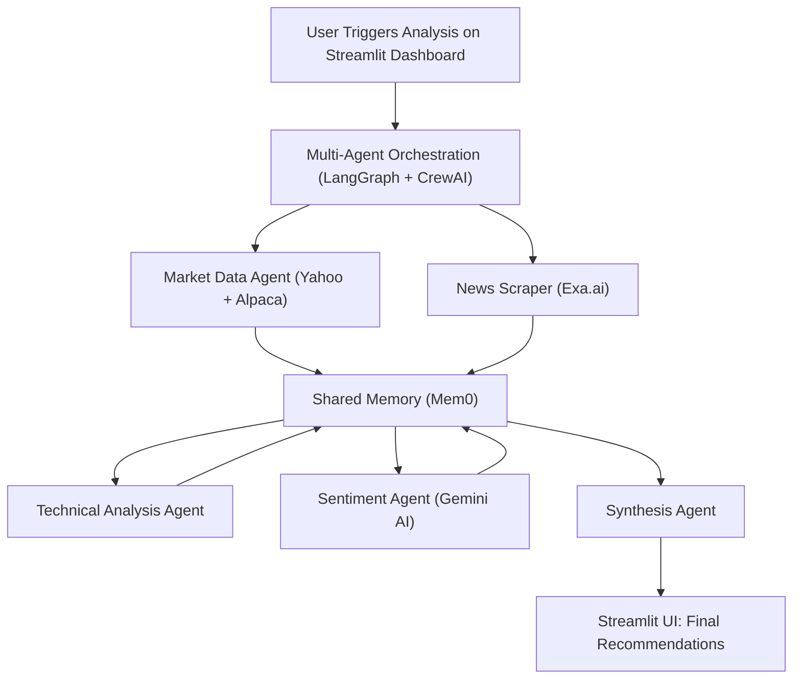

# 🧠 Stock Recommendation AI Platform

A full-stack, real-time stock analysis platform powered by **multi-agent AI**. This system analyzes live market data and financial news to provide actionable investment insights using intelligent agents, cutting-edge sentiment analysis, and technical indicators—all wrapped in a beautiful, responsive dashboard.

---

## ✨ Features

- 🔁 **Multi-Agent AI Backend** — Autonomous agents handle distinct responsibilities:
  - Market data collection
  - News scraping & summarization
  - Technical indicator computation
  - Sentiment analysis via Gemini AI
  - Synthesis & stock recommendation generation

- 📊 **Live Stock Recommendations** — Get explainable buy/sell/hold insights, refreshed in real time.

- 🖥️ **Next.js + Streamlit Dashboards** — Modern, responsive dashboards for both end-users and admins.

- 🧠 **Central Memory (Mem0)** — Allows agents to share context and intermediate results seamlessly.

- 📡 **Telemetry & Monitoring** — Integrated with Langfuse for token tracking, performance, and error logs.

---

## 🏗️ System Architecture



---

## ⚡ Quickstart

### 1. Clone the Repository
```bash
git clone https://github.com/yourusername/stock-ai-platform.git
cd stock-ai-platform
```

### 2. Backend Setup (Python 3.8+)
```bash
python -m venv venv
source venv/bin/activate  # On Windows: venv\Scripts\activate
pip install -r requirements.txt
uvicorn backend.api:app --reload
```
- API available at http://localhost:8000

### 3. Frontend Setup (Optional: Next.js UI)
```bash
cd frontend
npm install
echo "NEXT_PUBLIC_API_URL=http://localhost:8000/api" > .env.local
npm run dev
```
- Frontend available at http://localhost:3000

### 4. Streamlit Dashboard (Primary UI)
```bash
streamlit run frontend/app.py
```
- Streamlit UI available at http://localhost:8501

---

## 📁 Project Structure

```
stock-ai-platform/
├── backend/
│   ├── agents/              # Modular agents (market, news, sentiment, etc.)
│   ├── api/                 # External API integrations (Yahoo, Exa.ai, Gemini, Alpaca)
│   ├── memory/              # Shared memory layer (Mem0)
│   ├── orchestration/       # LangGraph and CrewAI orchestration
│   ├── telemetry/           # Langfuse integration
│   └── main.py              # Entrypoint for backend process
├── frontend/
│   ├── app.py               # Streamlit dashboard
│   ├── components.py        # Custom widgets
│   └── utils.py             # Helper functions
├── info/                    # Project documentation (BRD, setup guides, etc.)
├── requirements.txt         # Python dependencies
├── README.md
```

---

## 🧹 Key Technologies

| Layer         | Tech Stack                                 |
|-------------- |--------------------------------------------|
| Language      | Python 3.8+, JavaScript (TypeScript)       |
| Orchestration | LangGraph, CrewAI                          |
| Memory        | Mem0 (In-memory or Redis)                  |
| APIs          | Yahoo Finance, Exa.ai, Gemini AI, Alpaca   |
| UI Frameworks | Streamlit (primary), Next.js + Tailwind CSS (optional) |
| Telemetry     | Langfuse                                   |
| Utils         | pandas, NumPy, matplotlib                  |

---

## 🔧 Customization
- Add new agents in `/backend/agents/`
- Connect more APIs in `/backend/api/`
- Expand memory capabilities via `/backend/memory/`
- Add charts and custom filters in `/frontend/app.py`
- Tune agent workflows in `/backend/orchestration/`

---

## 🧪 Testing
```bash
# Run unit tests (coming soon)
pytest
```
- Integration tests and telemetry tracking via Langfuse

---

## 🤝 Contributing
We welcome contributions! Please follow the steps below:

```bash
# Fork & clone the repository
git checkout -b feature/my-feature
git commit -m "✨ Add my new feature"
git push origin feature/my-feature
# Open a Pull Request 🎉
```

---

## 📄 License
This project is licensed under the MIT License.

---

## 🙏 Acknowledgements
- Streamlit
- FastAPI
- Next.js
- Tailwind CSS
- CrewAI
- LangGraph
- Langfuse
- Gemini AI
